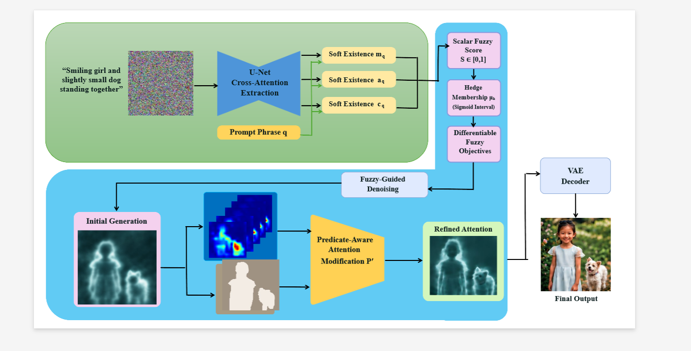

# FuzzyDiff: Fuzzy Logical Diffusion for Structured and Graded Image Generation

FuzzyDiff introduces **fuzzy-logic-guided diffusion** to improve text-to-image generation when prompts contain **graded, uncertain, or softly constrained semantics** such as *slightly*, *moderately*, or *roughly*. The method integrates **fuzzy reasoning directly into the denoising process**, enabling diffusion models to better interpret linguistic uncertainty and produce more semantically faithful images.

---

# Abstract

Diffusion models have demonstrated impressive text-to-image generation capabilities, producing high-fidelity images from natural-language prompts. However, they often struggle when prompts contain **graded or uncertain semantics**, frequently yielding **missing or inconsistent objects**. To address this, we propose **FuzzyDiff**, a fuzzy-logic-guided diffusion framework that explicitly represents linguistic uncertainty and propagates it throughout the denoising process to improve prompt-faithful image synthesis. FuzzyDiff converts cross-attention maps into **phrase-level spatial membership functions**, enabling prompt statements to be evaluated as **differentiable, graded truth values rather than binary constraints**. In addition, we introduce a **spatially guided attention refinement** that further strengthens attribute completeness by correcting residual omissions and refining weakly grounded regions. Extensive experiments on diverse prompts with **hedges and multi-attribute compositions** show that FuzzyDiff improves semantic faithfulness and reduces **missing-attribute failures** while maintaining strong visual quality, demonstrating the benefit of integrating **fuzzy reasoning into diffusion-based image generation**.

---

# Influence of Fuzzy Attributes on Image Generation


FuzzyDiff enables diffusion models to interpret **graded linguistic modifiers** and translate them into consistent visual changes.

Examples include:

* **Vehicle type**: A *moderately fast car* appears as a regular vehicle, while a *very fast car* becomes a high-performance sports car.
* **Snow intensity**: Mountain scenes transition from *slightly snow-covered* to *heavily snow-covered* terrain.
* **Lighting strength**: Indoor scenes evolve from *dimly lit* to *brightly illuminated* environments.
* **Object quantity**: Underwater scenes gradually increase the number of fish from *few* to *many*.

These examples demonstrate that **FuzzyDiff captures gradual semantic changes and translates them into coherent visual transformations.**

---

# Architecture



The diagram presents the intended flow from a text prompt and noisy latent to
an image. Its example prompt is **“Smiling girl and slightly small dog standing
together.”**

1. **Extract cross-attention.** The SDXL U-Net processes the latent with text
   conditioning. Cross-attention associates prompt tokens with spatial latent
   locations; tracked phrases select the token maps used for guidance.
2. **Compute fuzzy objectives.** Each tracked phrase is converted into a
   spatial membership function with values in `[0, 1]`: the phrase's share of
   the sharpened per-position distribution over the prompt's own tokens. A soft
   maximum of that map is the phrase's presence truth, and membership centroids
   give the truth of any explicitly requested 2D spatial relation. Truth values
   are combined with the Goedel t-norm (`min`) and turned into a loss by `-log`.
3. **Guide denoising.** Gradients of these objectives update the latent during
   selected denoising steps. The base stage decodes and saves an initial image.
4. **Apply spatially guided attention refinement.** The same phrase membership
   functions, computed from the aggregated base cross-attention, become soft
   spatial masks. The image-to-image refiner uses them to reweight conditional
   cross-attention and renormalizes the probabilities. Each phrase's correction
   is scaled by its membership deficit `1 - truth`, so residual omissions are
   corrected while already grounded phrases are left unchanged.
5. **Decode the output.** The VAE converts the refined latent into the final
   image. The runner saves both image stages and diagnostic metadata.

**Implementation scope.** This is a conceptual diagram, not a record of a
single measured run. The maintained notebook implements phrase presence and
the explicit relations `left_of`, `right_of`, `above`, and `below`. Guidance
runs for the first `max_iter_to_alter` denoising steps (30 of 50 by default),
not every step. The diagram's separate sigmoid-interval hedge membership block
is not implemented as a calibrated objective: words such as “slightly” are
interpreted by the pretrained model. Attribute scores such as smiling or
relative dog size are not independently calibrated. The refiner uses a decoded base image and
re-encodes it for image-to-image processing, although that intermediate decode
is omitted from the diagram.

**Reading the image panels.** Cyan silhouettes are illustrative mask-based
glow effects, not measured attention. The separately generated DINO heatmaps
in this workspace are vision-model self-attention on an uploaded photo;
they are not SDXL U-Net cross-attention. To report attention before and after
FuzzyDiff refinement, capture and label maps from the corresponding actual
model forwards. These example panels do not establish a refinement gain.

The implementation is in
[`pipeline_fuzzy/fuzzydiff-fullpipeline.ipynb`](pipeline_fuzzy/fuzzydiff-fullpipeline.ipynb);
[`run_fullpipeline.py`](run_fullpipeline.py) executes its code cells.

---

# Highlights


---

# Installation

## System Requirements

* **GPU:** NVIDIA GPU; the main notebook targets a Kaggle T4 with CPU offload.
* **Memory:** Models run sequentially on GPU 0; T4 ×2 does not pool VRAM. Actual
  T4 peak memory must be checked with the smoke test before a full run.
* **Python:** 3.10+ with CUDA-enabled PyTorch (keep Kaggle's preinstalled PyTorch).
* **Internet:** Required to clone the repository and download model weights.

---

### Install CLIP (for evaluation)

```bash
pip install git+https://github.com/openai/CLIP.git
```

---

# Usage

The maintained entry point is `pipeline_fuzzy/fuzzydiff-fullpipeline.ipynb`.
The other pipeline notebook is an older experiment and has not received these fixes.

In Kaggle, enable **Internet** and select **GPU T4 ×2**, then run:

```python
!git clone https://github.com/sunzidulislam/fuzzydiff.git /kaggle/working/fuzzydiff
%cd /kaggle/working/fuzzydiff
%pip install -r requirements.txt
!nvidia-smi
%run run_fullpipeline.py
```

For an existing checkout, use `!git pull --ff-only` inside that directory instead
of cloning again. These changes must be committed and pushed to GitHub before
Kaggle can retrieve them.

The default smoke test generates a 512 × 512 image with four base steps and
eight refiner steps (strength 0.4). It checks execution, not final image quality.
After it succeeds, run the full 768 × 768 / 50 base-step configuration:

```python
%run run_fullpipeline.py --full
```

Each seed writes `seed_<seed>_stage1.png`, `seed_<seed>_stage2_refined.png` and
`seed_<seed>_metadata.json` to `/kaggle/working/outputs`. Stage one saves before
refinement starts, so its image survives a refiner error. Metadata records scores,
configuration, versions and actual fuzzy gradient/update magnitudes. Smoke and full
runs with the same seed overwrite those filenames; download smoke outputs first
if you want to keep them.

To run interactively, import the main notebook into Kaggle and run top to bottom.
Set `SMOKE_TEST = False` in its final cell for a full run. Change prompt, tracked
phrases, seeds, negative prompt and optional relations there. Supported explicit
relations are `left_of`, `right_of`, `above`, `below`; no spatial constraint is
added automatically. Model-loading cells must be rerun after the final cell unloads
the base pipeline.

The loss guides phrase presence and configured 2D relations. It does not calibrate
hedges such as "slightly" or "very", or depth relations such as "behind". Better
visual results require matched-seed comparison on GPU; CLIP scores alone do not
establish improvement. See [the full two-axis review](REVIEW.md).

If an image is distorted, diagnose stage one with a matched-seed comparison:

```python
%run run_fullpipeline.py --compare
```

This runs native SDXL, custom sampling with guidance disabled, and guidance at
each requested step size, using seed 142, 768 × 768 pixels, 50 steps and CFG 9.5.
It skips refinement. `--prompt`, `--words`, `--seed` and `--lr` override the
defaults; `--lr` takes a comma-separated list and renders one image per value:

```python
%run run_fullpipeline.py --compare --prompt "a red book and a yellow clock" --words "red book,yellow clock" --lr 0.2,2,20
```

Each run records `phrase_truth`, the method's own graded objective. Compare the
guidance-off truths against each step size: that is the direct measurement of
whether fuzzy guidance grounds the tracked phrases, where CLIP similarity is only
a coarse proxy. Images and scores
save to `/kaggle/working/outputs/comparison_seed_142`. Inspect all three before
changing prompts or claiming a visual improvement. Small gradients are no longer
normalized into fixed-size updates; updates preserve their magnitude, cap RMS at
0.01, and retain float32 latent precision. Because membership is bounded in
`[0, 1]` instead of carrying the raw `1/context` attention scale, the loss now has
real dynamic range and CPU fixtures show gradients two to three orders of magnitude
above the previously recorded `1e-5`. Read `update_ratio` in the guidance
diagnostics first: it reports the update RMS relative to the latent RMS, and
`clipped` says whether the absolute `0.01` ceiling is what limited the step. That
ceiling has not been retuned on GPU since the membership change.
Native SDXL uses its usual latent precision; the custom runs use float32 latents.
Compare the two custom images to isolate the effect of guidance. Native-versus-custom
differences also include latent precision and attention implementation differences.

CPU regression checks (no model downloads):

```bash
python -m unittest discover -s tests -v
python run_fullpipeline.py --check
```

## Snow coverage research experiment

For the **fixed-scene 9 x 11 coverage/thickness grid**, use the separate mode:

```python
!python run_snow_control.py --plan
!python run_snow_control.py
```

It creates one FuzzyDiff bare-rock mountain scene, estimates a terrain mask on
CPU, and applies explicit image-space snow rendering at 99 parameter settings.
The figure includes axes and a clean reference beneath, following the requested
layout. Relative thickness controls opacity/texture, not physical snow depth.
This demonstrates renderer control; it does not establish improved fuzzy latent
guidance. Inspect the saved source and mask overlay. See [commands, definitions
and limitations](SNOW_CONTROL.md). Outputs use a separate `outputs/snow_control` folder.

The confirmed WaterGen-inspired layout evaluates five snow-cover prompt levels
across native SDXL, current FuzzyDiff and FuzzyDiff plus refiner. It evaluates
the current method without adding a calibrated snow-severity objective.

After cloning and installing the requirements above:

```python
!python run_snow_experiment.py --plan
!python run_snow_experiment.py
```

The default pilot generates 15 images for alpine mountains, seed 142, at the
full 768px/50-step settings. Inspect it before expanding with
`!python run_snow_experiment.py --full` to three scenes, five seeds and 225
images. Each image is persisted; rerunning resumes completed work. Outputs
include PNG/PDF grids, diagnostics, runtime, failure records, and an anonymous
review pack for two independent human reviewers. There are no pre-filled human
ratings or claims of improved quality. See [the experiment protocol and full
Kaggle commands](SNOW_EXPERIMENT.md) for resuming across sessions and analyzing ratings.

---

# Stage 1: Fuzzy-Guided Generation

```python
image, scores, attn_store = generate(
    prompt=prompt,
    words_to_track=words_to_track,
    seed=seed,
    num_steps=50,
    guidance=9.5,
    height=768,
    width=768,
    max_iter_to_alter=30,
    attend_excite_lr=0.2,
    alpha=10.0,
    spatial_loss_weight=0.5,
)
```

Parameters such as **seed**, **negative prompts**, and **tracked tokens** can be adjusted depending on the prompt structure.

---

# Stage 2: Spatially Guided Attention Refinement

```python
refined = refine_with_predicate(image, prompt, attn_store)
```

The refinement stage reuses the stage-one phrase membership functions as soft
spatial masks and reweights the refiner's conditional cross-attention inside each
phrase's region. Each phrase's correction is scaled by its membership deficit
`1 - truth`, so the stage targets **residual omissions and weakly grounded
regions** rather than boosting every tracked phrase equally. Stage-one presence
truths are printed and recorded as `stage1_phrase_truth` in the run metadata.

# Baselines and Comparisons

We compare FuzzyDiff with several diffusion-based generation methods:

* **Stable Diffusion**
  [https://github.com/CompVis/stable-diffusion](https://github.com/CompVis/stable-diffusion)

* **Attend-and-Excite**
  [https://github.com/yuval-alaluf/Attend-and-Excite](https://github.com/yuval-alaluf/Attend-and-Excite)

* **Predicated Diffusion**
  [https://github.com/tksmatsubara/PredicatedDiffusion](https://github.com/tksmatsubara/PredicatedDiffusion)

* **SPO**
  [https://github.com/RockeyCoss/SPO](https://github.com/RockeyCoss/SPO)

* **C3**
  [https://github.com/daheekwon/C3](https://github.com/daheekwon/C3)

---
